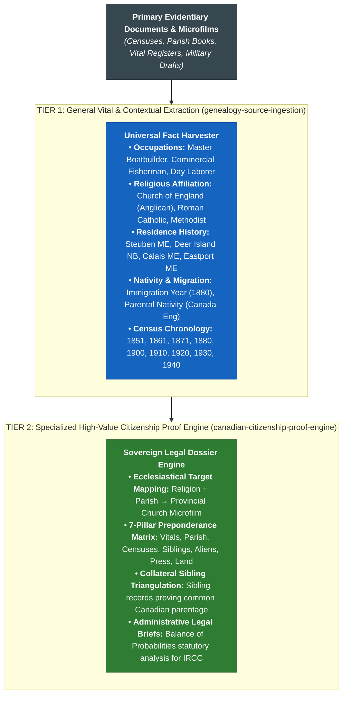

# canadian-citizenship-proof-engine

> Parent Skill Definition: [canadian-citizenship-proof-engine](file:///home/jpino/Obsidian/Genealogy/_Meta/Skills/canadian-citizenship-proof-engine/SKILL.md)

---
name: canadian-citizenship-proof-engine
description: Governs proof verification, dual-anchor lineage triangulation, 7-pillar preponderance matrix, archival church order generation, and IRCC dossier compilation under Bill C-3 / Senate Bill S-245, ADR-013, ADR-021, and SOP-GEN-008 across federated genealogy vaults.
---

# Canadian Citizenship Proof Engine Skill (Bill C-3 / S-245)

## 🏛️ Commercial Multi-Tenant Proof-as-a-Service Architecture

This specialized high-value skill transforms primary evidence into an unassailable legal filing dossier for Immigration, Refugees and Citizenship Canada (IRCC) under **Bill C-3 / Senate Bill S-245** (*An Act to amend the Citizenship Act*). It operates across any client vault portfolio:
* **Internal Flagship Portfolio**: Whalen Lineage (`Canada-Citizenship` / New Brunswick roots).
* **Client Portfolios**: Portright Lineage (`Kamas` / Quebec roots), Roy Lineage (`Nary` / Quebec roots), and new commercial onboarding.

---

## 🔬 Two-Tier Skill & Extraction Framework

---

## ⛪ Ecclesiastical Parish Repository Mapping Rule: *Religion & Birthplace as Master Keys*

Prior to mandatory provincial civil registration (1888 in New Brunswick, 1897 in Nova Scotia, 1926 in PEI, 1994 in Quebec), **Canadian provincial governments did not issue civil birth certificates**. Vital records were maintained exclusively by **local parish churches**.

To target archival search orders deterministically without searching hundreds of irrelevant microfilm reels, the engine cross-references extracted `religion` and historical parish:

| Province / Jurisdiction | Extracted Religion / Denomination | Archival Repository | Target Holding Class / Search Reel |
| :--- | :--- | :--- | :--- |
| **New Brunswick (Charlotte Co.)** | **Church of England (Anglican)** | Provincial Archives of New Brunswick (PANB) | **Reel F-1589** (Parish of St. George & West Isles Baptisms 1860) |
| **New Brunswick (Charlotte Co.)** | **Roman Catholic** | PANB & Diocese of Saint John | St. Malachy’s / St. Stephen Catholic Church Registers |
| **Quebec (Canada East)** | **Wesleyan Methodist / Protestant** | BAnQ / LAC / Drouin Collection | Civil Non-Catholic Registers of Canada East |
| **Quebec** | **Roman Catholic** | BAnQ / Drouin Institute / LAC | **LAC Reel C-10086** & Parish Registers |
| **Nova Scotia (Hants Co.)** | **Anglican / Baptist** | Nova Scotia Archives (PANS) | Falmouth & Newport Township Books (Reel 13867) |
| **Ontario** | **Methodist / Presbyterian / Anglican** | Archives of Ontario (AO) | Vital Records Series MS948 & United Church Archives |

---

## 📊 The 7-Pillar Exhaustive Preponderance of the Evidence Matrix

Under IRCC Guidelines (**CP 3 & CP 14**), proof by descent is governed by the civil standard:
$$\text{Standard of Proof} = \mathbf{Balance\ of\ Probabilities}\ (\ge 51\%\ \text{Preponderance of Evidence})$$

The engine compiles an unassailable dossier across 7 distinct evidentiary pillars:
1. **Pillar 1: Primary State & Provincial Vitals**: Certified long-form state birth certificates ($G0, G1, G2$).
2. **Pillar 2: Archival Parish Microfilms**: Contemporaneous baptismal entries from PANB, BAnQ, or PANS.
3. **Pillar 3: Multi-Decennial Census Triangulation**: Pre- and post-Confederation federal returns (1851, 1861, 1871, 1880, 1900 Sheets 6A/6B, 1910, 1920, 1930, 1940, 1950) verifying consistent declaration of Canadian nativity across decades.
4. **Pillar 4: Collateral Sibling Triangulation**: Sibling birth, marriage, and death records (e.g. William H. Whalen 1903, Thomas E. Whalen 1914) certifying identical parents born in New Brunswick.
5. **Pillar 5: Naturalization & Alien Status Proof**: NARA naturalization petitions and federal census alien declarations proving unbroken Canadian/British subject status.
6. **Pillar 6: Historical Press & Gazettes**: *The Eastport Sentinel*, *The St. Croix Courier*, *The Kalamazoo Gazette*, *The Washington Post* verifying lived family history, occupations, and community milestones.
7. **Pillar 7: Land, Probate & Trade Licenses**: County deed registries, fishery bounty records, and almshouse reports.

---

## 🚀 Standardized 5-Asset Client Deliverable Suite

Every client vault automatically receives the turnkey 5-asset deliverable suite:
1. `00_Projects_and_Dashboards/00_Master_Dashboard.md`: Portfolio status, applicant transmission summary, and quick links.
2. `00_Projects_and_Dashboards/1_Canadian_Citizenship_Executive_Evidence_Summary.md`: 7-Pillar Preponderance Brief, Bill C-3 statutory analysis, and transparent LLM-as-Judge scorecard.
3. `00_Projects_and_Dashboards/2_Canadian_Citizenship_Archival_Request_Packet.md`: Turnkey archival search order letters with exact reference codes for PANB, LAC, or BAnQ.
4. `00_Projects_and_Dashboards/3_Archival_Research_Strategy.md`: Repository guide mapping extracted denominations to target reels.
5. `00_Projects_and_Dashboards/Family_Citizenship_Descent_Tree.canvas`: Interactive generational visual descent canvas.

