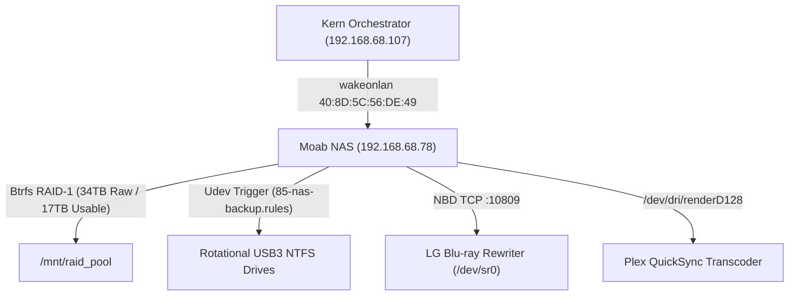

# moab-nas-appliance

> Parent Skill Definition: [moab-nas-appliance](file:///home/jpino/Obsidian/Common/_Meta/Skills/moab-nas-appliance/SKILL.md)

---
name: moab-nas-appliance
description: Operational skill and procedural runbook for provisioning, managing, monitoring, waking, and auditing the Moab Headless Linux NAS Appliance (Ubuntu Server 24.04 LTS, Btrfs RAID-1, S3 WOL, Plex QuickSync Gen 9, Hauppauge DVB, and Udev Rotational Air-Gap Backup) under SYS-INF-015 and ADR-040.
---

# Moab Headless Linux NAS Appliance Operational Skill

## 1. Overview & Architecture

Governs operational commands, troubleshooting, telemetry, and automated workflows for the **Moab Headless Linux NAS Appliance** under **ADR-040** (`SYS-INF-015`) and **ADR-002** (`SYS-BKP-001`).



---

## 2. Core Operational Runbook

### 1. Wake-on-LAN & S3 Standby Power Cycling
```bash
# Wake Moab from Kern or Mobile:
wakeonlan 40:8D:5C:56:DE:49

# Test S3 Deep Sleep from Moab / SSH:
ssh nasadmin@192.168.68.78 "sudo systemctl suspend"
# Expected standby power draw: ~1.0W - 1.5W
```

### 2. Btrfs RAID-1 Status & Bitrot Scrubbing
```bash
# Check filesystem utilization:
btrfs filesystem usage /mnt/raid_pool
btrfs filesystem df /mnt/raid_pool

# Start monthly bitrot scrubbing:
sudo btrfs scrub start /mnt/raid_pool
# Check scrub progress:
sudo btrfs scrub status /mnt/raid_pool
```

### 3. Remote Optical Drive Rip (MakeMKV via NBD on Kern)
```bash
# Connect Kern to Moab optical drive over Cat6a:
sudo nbd-client 192.168.68.78 -N bluray /dev/nbd0

# Launch MakeMKV on Kern pointing to /dev/nbd0:
makemkvcon mkv dev:/dev/nbd0 all /mnt/landing/rips/

# Disconnect when finished:
sudo nbd-client -d /dev/nbd0
```

### 4. 4-Drive Rotational Air-Gap Backup Execution
```bash
# Manual trigger of rotational backup script:
sudo bash /usr/local/bin/nas_to_external.sh

# Monitor active backup log:
tail -f /var/log/nas_backup.log
```

---

## 3. Hardware Reference Card

* **Host MAC Address**: `40:8D:5C:56:DE:49` (Intel I219-V GbE)
* **Motherboard**: Gigabyte H170-D3HP (LGA1151)
* **CPU / GPU**: Intel Core i7-6700 (4C/8T @ 3.4GHz, HD Graphics 530 / QuickSync Gen 9)
* **RAM**: 32 GB DDR4-2133 (Dual-Channel)
* **OS Drive**: Samsung SSD 830 Series 256GB (`S0Z4NEAC954682`)
* **Storage Disks**: 3x 6TB Toshiba + 2x 5TB Toshiba + 2x 3TB HGST = 7 HDDs
* **TV Tuner**: Hauppauge WinTV-HVR-2250 Dual Hybrid PCIe (`saa7164` driver)
* **Optical**: LG WH16NS40 Blu-ray Rewriter (M-DISC BDXL)

