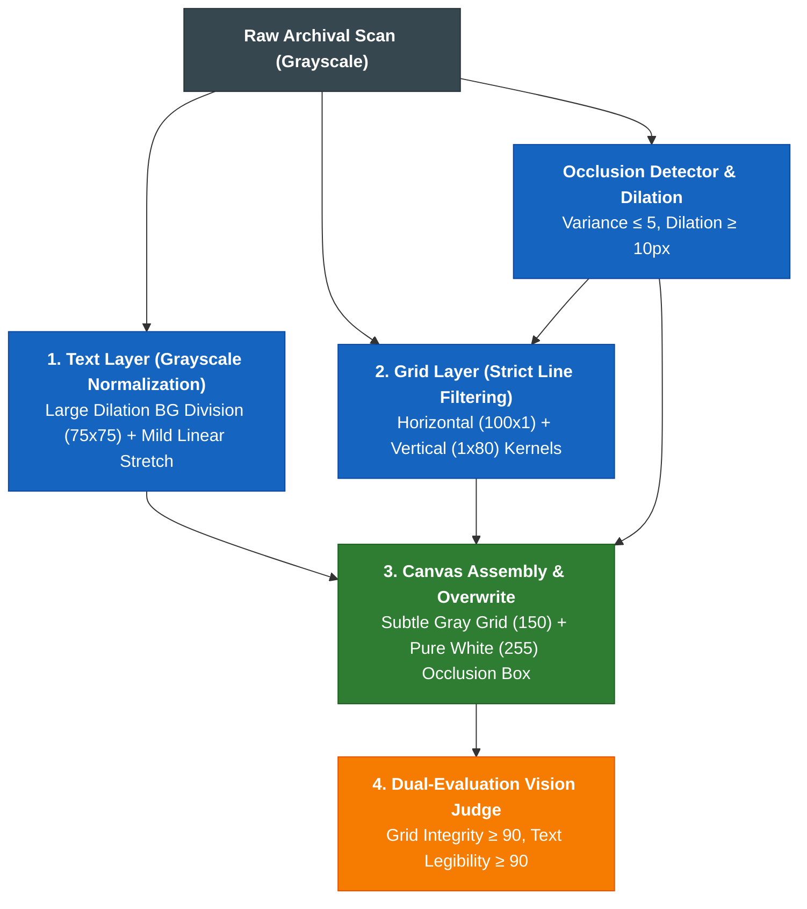

# archival-vision-engine

> Parent Skill Definition: [archival-vision-engine](file:///home/jpino/Obsidian/Genealogy/_Meta/Skills/archival-vision-engine/SKILL.md)

---
name: archival-vision-engine
description: Governs decoupled two-layer document restoration (grayscale illumination normalization, strict line filtering, occlusion nullification), paleographic legibility scoring, and closed-loop Vision Judge optimization across historical microfilms.
---

# Archival Vision Engine (`archival-vision`)

Governs deterministic image restoration, paleographical transcription, and closed-loop visual quality gates for degraded 19th-century census schedules, parish registers, and civil microfilms under **ADR-020** and **ADR-021**.

---

## 🏛️ Core Principles & Architecture



### 1. Text Layer: Grayscale Illumination Normalization
* **Prohibition of 1-bit Hard Binarization:** Never use hard binary Sauvola or Otsu on delicate cursive handwriting. Preserve anti-aliased grayscale stroke transitions.
* **Background Illumination Division:** Estimate background luminance using a $75 \times 75$ morphological dilation (`cv2.MORPH_DILATE`) and divide:
  $$\text{Norm} = \frac{\text{Gray}}{\text{Background}} \times 255$$
* **Linear Contrast Stretch:** Darkens ink tones slightly ($2\text{nd} \text{ to } 98\text{th}$ percentile) without amplifying background grain.

### 2. Grid Layer: Strict Line Filtering
* **Long Directional Kernels:** Requires horizontal kernels $\ge 100\text{px}$ (`cv2.MORPH_RECT, (100, 1)`) and vertical kernels $\ge 80\text{px}$ (`cv2.MORPH_RECT, (1, 80)`) to strictly prevent false detection on handwriting dashes.
* **Subtle Gray Overlay:** Grid lines are composited with subtle gray intensity ($150$), avoiding harsh black strokes.

### 3. Occlusion Masking: Pure White Overwrite
* **Zero Processing of Synthetic Overlays:** Low-variance digital microfilm redactions or tape strips are detected, dilated by $\ge 10\text{px}$, and explicitly overwritten with pure white ($255$).

---

## 💻 CLI & Python Usage

### Python Execution
```python
from archival_vision.document_pipeline import DocumentRestorationPipeline
from archival_vision.upscale import super_resolve_document

# Initialize pipeline with standard parameters
pipeline = DocumentRestorationPipeline(
    bg_dilation_size=75,
    contrast_clip_low=2.0,
    contrast_clip_high=98.0,
    grid_h_size=100,
    grid_v_size=80,
    grid_overlay_val=150
)

# Execute restoration
res = pipeline.composite(
    img_path="Sources/Microfilms/1861-Census-Master.jpg",
    output_path="/tmp/normalized.png"
)

# 2x Super-Resolution for archival deliverable
super_resolve_document(
    input_path="/tmp/normalized.png",
    output_path="Sources/Microfilms/1861-Census-Enhanced.jpg",
    scale=2
)
```

### Headless CLI
```bash
# Full goal loop execution
archival-vision goal-loop --input scan.jpg --output enhanced.jpg --max-turns 10

# Single-pass restoration
archival-vision preprocess --input scan.jpg --output restored.png
```

---

## 🔬 Quality Gate & Vision Judge Criteria

| Metric | Target | Fail Condition |
| :--- | :---: | :--- |
| **Grid Integrity Score** | $\ge 90 / 100$ | Broken column dividers or non-white pixels inside occluded zone. |
| **Text Legibility Score** | $\ge 90 / 100$ | Salt-and-pepper noise ratio $> 0.3\%$ or washed-out ink density $< 2.0\%$. |


