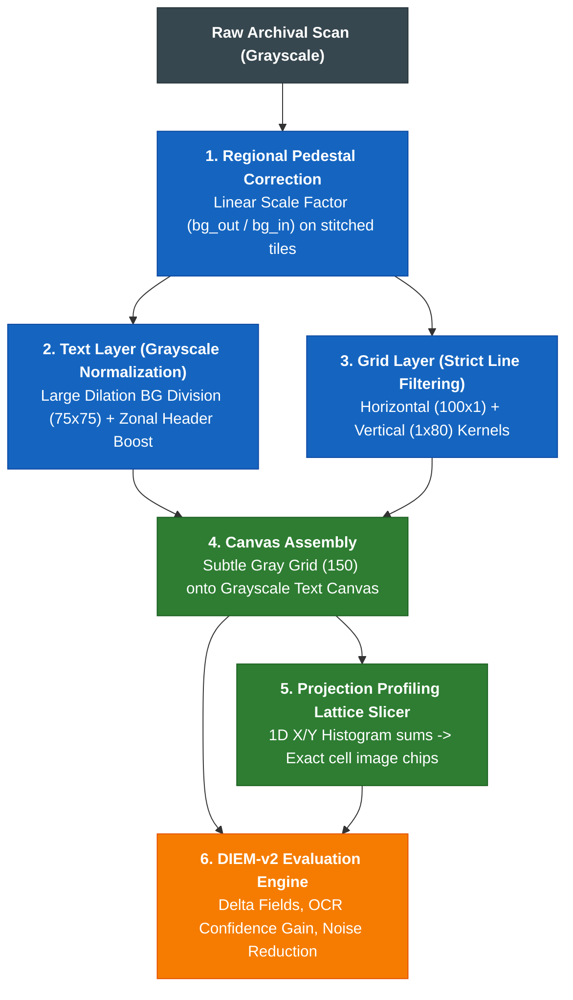

# archival-vision-engine

> Parent Skill Definition: [archival-vision-engine](file:///home/jpino/Obsidian/Genealogy/_Meta/Skills/archival-vision-engine/SKILL.md)

---
name: archival-vision-engine
description: Governs decoupled two-layer document restoration (grayscale illumination normalization, strict line filtering, regional pedestal shift recovery), paleographic legibility scoring, projection profiling table slicing, and closed-loop DIEM-v2 optimization across historical microfilms.
---

# Archival Vision Engine (`archival-vision`)

Governs deterministic image restoration, paleographical transcription, table lattice slicing, and closed-loop visual quality gates for degraded 19th-century census schedules, parish registers, and civil microfilms under **ADR-020**, **ADR-021**, and **SOP-GEN-008**.

---

## 🏛️ Core Principles & Architecture



### 1. Regional Pedestal Shift Normalization
* **Multi-Exposure & Stitched Selection Recovery:** Detects flat, low-variance digital overlays or stitched tile patches ($\text{Luminance} \approx 218$) and applies a linear scaling factor ($\text{Median BG}_{\text{out}} / \text{Median BG}_{\text{in}}$). Neutralizes grey tints without black border step artifacts.

### 2. Text Layer: Grayscale Illumination Normalization
* **Prohibition of 1-bit Hard Binarization:** Never use hard binary Sauvola or Otsu on delicate cursive handwriting. Preserve anti-aliased grayscale stroke transitions.
* **Background Illumination Division:** Estimate background luminance using a $75 \times 75$ morphological dilation (`cv2.MORPH_DILATE`) and divide:
  $$\text{Norm} = \frac{\text{Gray}}{\text{Background}} \times 255$$
* **Linear Contrast Stretch:** Darkens ink tones slightly ($2\text{nd} \text{ to } 98\text{th}$ percentile) without amplifying background grain.
* **Zonal Header Unsharp Boost:** Applies subtle high-pass sharpening on the top 12% bounding box.

### 3. Grid Layer: Strict Directional Line Filtering
* **Directional Morphological Kernels:** Horizontal kernels $\ge 100\text{px}$ (`cv2.MORPH_RECT, (100, 1)`) and vertical kernels $\ge 80\text{px}$ (`cv2.MORPH_RECT, (1, 80)`) strictly avoid false detection on cursive handwriting.
* **Subtle Gray Overlay:** Grid lines are composited with subtle gray intensity ($150$).

### 4. Projection Profiling Table Slicer (`lattice.py`)
* Sums pixel density along X and Y axes (`np.sum(grid, axis=0/1)`) to detect exact row and column coordinate peaks.
* Crops individual cell image chips with 2px interior margins and dispatches row batches to local GPU models (`qwen2.5-coder:32b` / `mistral-nemo:12b`).

---

## 💻 CLI & Python Usage

### Python Execution
```python
from archival_vision.document_pipeline import DocumentRestorationPipeline
from archival_vision.upscale import super_resolve_document
from archival_vision.lattice import slice_document_cells
from archival_vision.diem import compute_diem_scorecard

# 1. Initialize pipeline with standard parameters
pipeline = DocumentRestorationPipeline(
    bg_dilation_size=75,
    contrast_clip_low=2.0,
    contrast_clip_high=98.0,
    grid_h_size=100,
    grid_v_size=80,
    grid_overlay_val=150,
    pedestal_correction=True,
    header_boost=True
)

# 2. Execute restoration
res = pipeline.composite(
    img_path="Sources/Microfilms/1861-Census-Master.jpg",
    output_path="/tmp/normalized.png"
)

# 3. 2x Super-Resolution for archival deliverable
super_resolve_document(
    input_path="/tmp/normalized.png",
    output_path="Sources/Microfilms/1861-Census-Enhanced.jpg",
    scale=2
)

# 4. Slice table lattice into cell chips
seg_res = slice_document_cells(
    img_path="Sources/Microfilms/1861-Census-Enhanced.jpg",
    output_chips_dir="/tmp/1861_chips"
)

# 5. Compute DIEM-v2 scorecard
scorecard = compute_diem_scorecard(
    raw_path="Sources/Microfilms/1861-Census-Master.jpg",
    enhanced_path="Sources/Microfilms/1861-Census-Enhanced.jpg"
)
```

---

## 🔬 DIEM-v2 Quality Gate Criteria

| Metric | Target | Fail Condition |
| :--- | :---: | :--- |
| **DIEM Composite Score** | $\ge 85.0 / 100$ | Score $< 85.0$ or field count regression ($\Delta\text{Fields} < 0$). |
| **OCR / HTR Mean Confidence Gain** | $\ge +10.0\%$ | Negative confidence delta or lost handwriting strokes. |
| **Background Noise Reduction** | $\ge 30.0\%$ | Noise density increase after contrast stretch. |
| **Ditto Antecedent Resolution** | $100.0\%$ | Misassigned ditto marks or column offset errors. |

