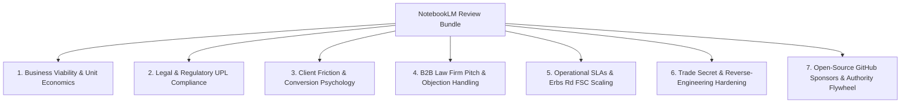

# notebooklm-synthesis-engine

> Parent Skill Definition: [notebooklm-synthesis-engine](file:///home/jpino/Obsidian/Genealogy/_Meta/Skills/notebooklm-synthesis-engine/SKILL.md)

---
name: notebooklm-synthesis-engine
description: Governs the discovery, source bundling, naming taxonomy, and adversarial evaluation of Google NotebookLM and Gemini notebooks across federated vaults for zero-token grounded synthesis and LLM-as-Judge reviews.
version: 1.0.0
---

# 🧠 NotebookLM & Gemini Notebook Synthesis Engine

## 🏛️ Purpose & Scope
This skill governs how AI agents discover, bundle, structure, and query **Google NotebookLM** notebooks and **Gemini Notebooks** across the workspace. Under the user's **Google One AI Premium (Ultra)** subscription, NotebookLM provides grounded, zero-token cost, long-context reasoning over complete document corpora with strict citation integrity.

---

## 🏷️ Standard Notebook Naming & Discovery Taxonomy

When creating, referencing, or syncing notebooks with NotebookLM, all agents MUST follow this standardized naming convention:

```
[Domain] - [Project / Target] - NotebookLM Review Bundle
```

### Standard Workspace Notebooks:
* `Canadian Citizenship - Master Commercial & Proof Portfolio - NotebookLM Review Bundle`
* `Peruvian Lineage - Archival Field Guide & DGS Sourcing - NotebookLM Review Bundle`
* `Spanish Citizenship LMD - Archival Holdings & Legal Proof - NotebookLM Review Bundle`
* `Obsidian Knowledge Engine - Architecture & System Governance - NotebookLM Review Bundle`

---

## 📦 Source Bundle Compilation Standard

To ingest multi-document projects into NotebookLM without missing cross-references:
1. **Aggregated Bundle Note**: Generate a unified Markdown bundle in `Notes/Projects/<Domain>/NotebookLM_Review_Bundle_<Project>.md`.
2. **Document Delimiters**: Each document must be wrapped with clear metadata headers:
   ```markdown
   ================================================================================
   # DOCUMENT: <Document Title>
   **Source Path:** `<Vault-Relative Path>`
   ================================================================================
   ```
3. **Table of Contents & Judge Persona Preamble**: Include clear role instructions at the top for Gemini 1.5 Pro / Ultra inference.

---

## ⚖️ Standard "LLM-as-a-Judge" Evaluation Rubrics

When deploying NotebookLM or Gemini as an independent evaluator, execute queries across the **7 Standard Diagnostic Dimensions**:



1. **Business Viability & Pricing**: Stress-test margins, retainer crediting, and refund resistance.
2. **Legal & UPL Compliance**: Verify statutory self-representation boundaries and lawyer add-on separation.
3. **Client Conversion & Psychology**: Red-team marketing copy for clarity, trust, and objection handling.
4. **B2B Law Firm Wholesale**: Evaluate law firm incentives, wholesale margins ($2,000 flat), and non-compete safety.
5. **Operational Capacity**: Model 10-minute Erbs Road FamilySearch Center trip logistics under high caseload.
6. **Trade Secret Moats**: Ensure zero leakage of OCR prompt weights, bilateral filter parameters, or scraping code.
7. **Developer Authority**: Assess GitHub Sponsors placement and open-source brand equity.

---

## 🎙️ Audio Overview (Deep Dive Podcast) Standard

For every newly compiled project notebook in NotebookLM:
1. Trigger **`Generate Audio Overview`** in NotebookLM Studio.
2. The resulting 8–15 minute AI podcast should be listened to during mobile/commute sessions for high-level adversarial feedback and conversational synthesis.

